# Doctor Digital Twin

## Technical Documentation

**Project type:** Full-stack clinical workflow prototype  
**Audience:** Academic review, technical demonstration, and engineering handover  
**Document date:** 20 September 2026  
**Status:** Implemented and locally verified  

> **Important:** This system uses synthetic data and is a software prototype. It is not a medical device, does not provide autonomous diagnosis, and requires clinical, privacy, security, and regulatory review before any real-world use.

---

## 1. Executive Summary

Doctor Digital Twin is a configurable clinical-assistance prototype that models an individual doctor's working preferences while retaining deterministic safety controls and human oversight. A patient submits symptoms through a conversational intake. The system combines patient context, the selected doctor's profile, approved doctor memories, and prior visits to produce a structured assessment with Google Gemini. A separate deterministic safety engine then checks patient-authored statements and can override the model's risk classification.

The same Doctor Twin implementation supports four deployment modes:

- **SHADOW:** collects information and creates a factual case; it does not suggest diagnosis or action.
- **COPILOT:** proposes an assessment and diagnostic tests for doctor review.
- **INTAKE:** structures the case and escalates AMBER or RED cases to a doctor.
- **AUTONOMOUS:** permits only allowlisted low-risk actions and evidence-gated diagnostic-test ordering; all unsafe or insufficiently supported cases go to a doctor.

The project also includes doctor review and case closure, governed memory learning, appointment scheduling, an admin-managed diagnostic-test catalog, doctor-specific test-decision learning, an evaluation suite, audit events, and patient/doctor/admin web experiences.

### Verified implementation snapshot

| Area | Current state |
| --- | --- |
| Backend | FastAPI, Pydantic v2, SQLAlchemy, SQLite |
| AI provider | Google Gemini through a replaceable `LLMClient` protocol |
| Frontend | Next.js 16.3.5, React 19.2.0, TypeScript 5.6.3 |
| API surface | 31 operations including health |
| Synthetic evaluation set | 32 cases: 10 GREEN, 10 AMBER, 6 RED, 6 ambiguous |
| Automated verification | 119 backend tests and 3 frontend tests passing; production frontend build successful |
| External clinical integration | Mock adapter only; no real EHR/MCP transport |

---

## 2. Problem Statement and Objectives

Clinical AI systems must gather useful information without allowing uncertain model output to bypass safety or human governance. A generic assistant also cannot represent differences in how individual doctors ask questions, escalate cases, communicate, or select tests.

This project addresses those concerns through five objectives:

1. Create one reusable Doctor Twin that is personalized at runtime for each doctor.
2. Separate probabilistic AI reasoning from deterministic safety and deployment policy.
3. Keep the doctor as final authority for assessment, tests, memory, and case closure.
4. Learn only from explicitly governed data: approved memories and finalized doctor decisions.
5. Provide measurable, testable behavior through synthetic evaluations and hermetic automated tests.

### Scope

**Implemented:**

- Patient registration, profile selection, known conditions, allergies, and resumable intake.
- Multi-turn intake with one natural follow-up question per model response.
- Structured Gemini assessment and fail-safe handling.
- Deterministic red-flag override and escalation.
- Four deployment modes stored per doctor and snapshotted per encounter.
- Doctor assessment approval/modification, test selection, and explicit closure.
- Governed candidate/approve/reject memory lifecycle.
- Diagnostic-test catalog, recommendations, feedback labels, evidence retrieval, and autonomous gates.
- Synthetic appointments and clinical-note audit capture.
- Evaluation runner and persisted results.
- Admin onboarding, catalog management, and protected data reset.
- Patient, doctor, and admin frontend experiences.

**Not implemented:**

- Production authentication, authorization, consent, or tenancy.
- Real patient data, EHR, laboratory, billing, or scheduling integrations.
- A real MCP stdio/JSON-RPC server.
- Semantic vector retrieval with pgvector.
- Database migrations, containers, production deployment, or observability infrastructure.

---

## 3. System Context

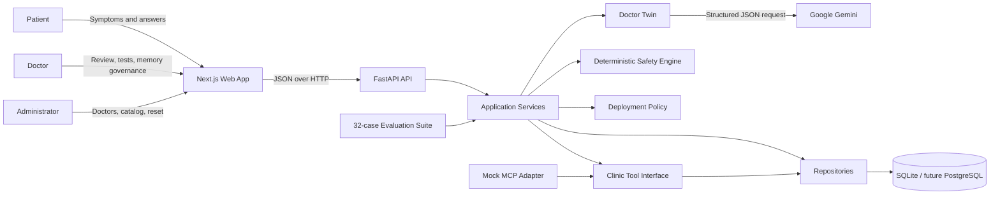

### Architectural principle

The LLM proposes structured information; it does not own final safety or operational authority. Safety, deployment permissions, lifecycle transitions, memory promotion, and autonomous diagnostic-test gates are enforced in deterministic application code.

---

## 4. Technology Stack

| Layer | Technology | Purpose |
| --- | --- | --- |
| Web | Next.js App Router | Persona-based frontend and production build |
| UI | React + TypeScript + CSS | Typed components and custom clinical design system |
| HTTP API | FastAPI | Routing, validation, dependency injection, OpenAPI |
| Contracts | Pydantic v2 | Request, response, and LLM structured-output validation |
| Persistence | SQLAlchemy 2 | ORM models and repository abstraction |
| Local database | SQLite | Disposable synthetic development storage |
| AI | `google-generativeai` | Gemini JSON generation for assessments and memory extraction |
| Backend tests | pytest + FastAPI TestClient | Unit and integration tests with in-memory SQLite |
| Frontend tests | Vitest + Testing Library | Component and interaction tests |
| Development | Uvicorn + Next.js dev server | Reloading local application servers |

The backend dependencies use bounded major versions rather than exact pins. The frontend package versions are exact. Node.js 22.12+ and Python 3.11+ are expected.

---

## 5. Component Architecture

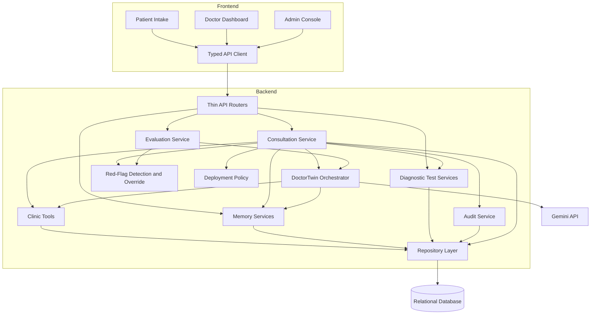

### Backend responsibilities

| Package | Responsibility |
| --- | --- |
| `api/` | HTTP routing, dependency injection, status-code mapping |
| `agents/` | Prompt construction, Gemini client, structured parsing, deployment policy |
| `safety/` | Deterministic red-flag detection and risk override |
| `services/` | Cross-module consultation, evaluation, audit, test, and reset workflows |
| `memory/` | Approved-memory retrieval and governed learning lifecycle |
| `tools/` | Controlled patient, visit, appointment, and note operations |
| `repositories/` | Entity-specific persistence operations |
| `models/` | Shared Pydantic contracts, enums, and SQLAlchemy entities |

The API routers remain deliberately thin. Business rules are concentrated in services, agents, safety, memory, and tools so they can be tested independently.

---

## 6. Personas and Frontend

The root route redirects to the route associated with the selected persona.

| Route | Persona | Main capabilities |
| --- | --- | --- |
| `/intake` | Patient | Select/register profile, select doctor, resume an open case, submit symptoms, answer follow-ups, view emergency guidance or appointment slots |
| `/dashboard` | Doctor | Select doctor, set mode, review cases, approve/modify assessments, finalize tests, create appointments, close cases, govern memory, run evaluations |
| `/admin` | Administrator | Onboard doctors, manage the diagnostic-test catalog, inspect row counts, reset non-baseline data |

Memory management is integrated into the doctor dashboard as a top-level tab. The older standalone `/memory` route described in some historical context is not part of the current route tree.

### Patient experience

- Existing patients select a synthetic profile; new patients can self-register.
- Known chronic/general conditions, medications, and allergies are included in model context.
- Open, unreviewed encounters can be resumed.
- Patient messages render optimistically while the twin is processing.
- The composer is disabled for RED emergencies; the patient is directed to show the case to a doctor.
- Clinical assessment details remain doctor-facing; the patient receives collection, scheduling, or escalation guidance.

### Doctor experience

- Cases are sorted for review, with optional closed history.
- SHADOW cases show a factual intake summary and require the doctor to author the clinical response.
- Other modes can show structured model proposals, while the doctor may approve or modify them.
- Diagnostic recommendations are visually distinct from doctor selections.
- Closing a reviewed case triggers best-effort memory extraction.
- Memory is organized by five categories and three statuses.

### Admin experience

- New doctors always start in SHADOW mode.
- Catalog entries can be created, edited, activated/deactivated, and marked autonomous-eligible.
- Data reset requires the exact phrase `RESET ADDED DATA` and preserves deterministic baseline records.

---

## 7. Core Consultation Workflow

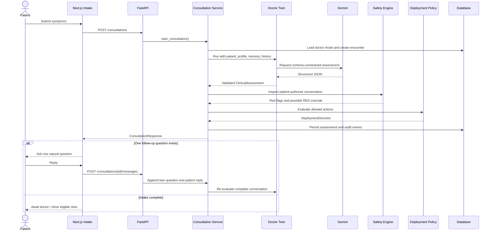

### Structured assessment contract

Every model assessment must validate as `ClinicalAssessment`:

- symptoms;
- zero or one missing-information question;
- GREEN, AMBER, or RED risk;
- escalation decision and reason;
- factual summary;
- recommended action;
- confidence in the range $[0,1]$;
- fail-safe marker;
- up to five catalog-coded diagnostic-test recommendations.

Follow-up collection is bounded to five answered questions. Previously asked questions are suppressed to prevent loops. Each persisted conversation alternates explicit `patient` and `twin` turns so safety checks and subsequent prompts receive reliable context.

### Failure behavior

If Gemini is missing, unavailable, rate-limited, returns malformed JSON, or violates the schema, the Doctor Twin returns a deterministic fallback:

- risk becomes AMBER;
- escalation is required;
- confidence becomes `0.0`;
- `fallback_used` becomes `true`;
- the case remains visible for doctor review;
- the API does not expose a provider failure to the patient.

Unreadable stored assessments are also converted to an AMBER fallback while listing cases, preventing one corrupted row from crashing an entire dashboard.

---

## 8. Safety Architecture

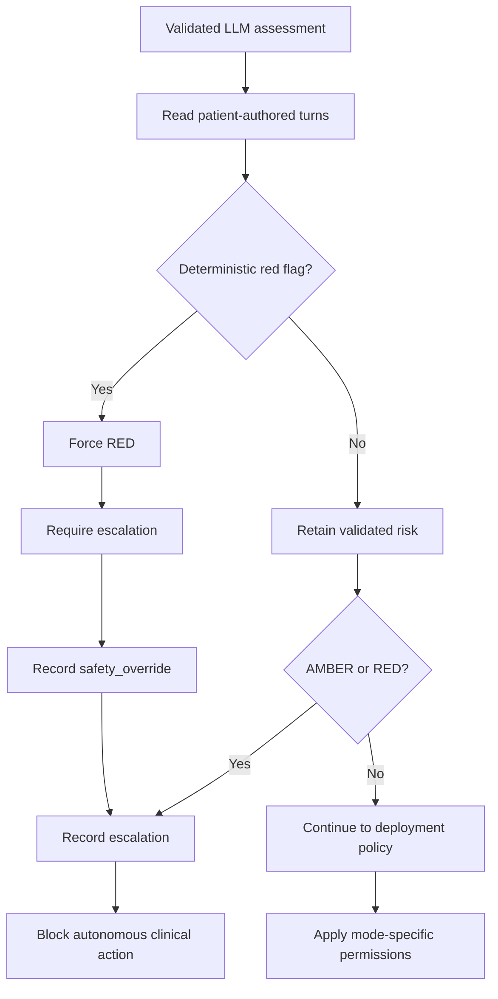

The detector recognizes synthetic keyword categories for severe chest pain, breathing difficulty, loss of consciousness, stroke-like symptoms, severe allergic reaction, and severe bleeding. It evaluates patient-authored statements, handles local negation, and treats a short affirmative reply as confirmation only when the immediately preceding twin question is an unambiguous single safety question. A twin-authored question cannot trigger its own red flag.

### Safety invariants

1. The model never has final authority over risk.
2. A detected red flag forces RED and escalation in every deployment mode.
3. AMBER and RED cannot execute autonomous actions.
4. Invalid model output fails toward human review, not silent success.
5. Patients do not receive the internal assessment except emergency guidance required by the UI flow.
6. Safety overrides, escalations, review decisions, test decisions, closure, and extraction failures are auditable.

---

## 9. Deployment Modes

| Mode | Twin behavior | Doctor role | Automated action |
| --- | --- | --- | --- |
| SHADOW | Ask preliminary questions and create a factual summary only | Writes assessment/action and selects tests | None |
| COPILOT | Propose assessment and catalog-constrained tests | Approves, rejects, modifies, or replaces | None |
| INTAKE | Collect information and create structured case | Reviews escalated case | No clinical action; AMBER/RED escalation |
| AUTONOMOUS | Propose assessment/tests | Reviews anything gated or escalated | Only allowlisted GREEN actions and separately gated tests |

AUTONOMOUS clinical actions are limited to `provide_informational_guidance` and `close_case` for GREEN assessments. Any other action is routed to a doctor. Diagnostic-test autonomy has stricter independent gates described below.

---

## 10. Doctor Review and Case Lifecycle

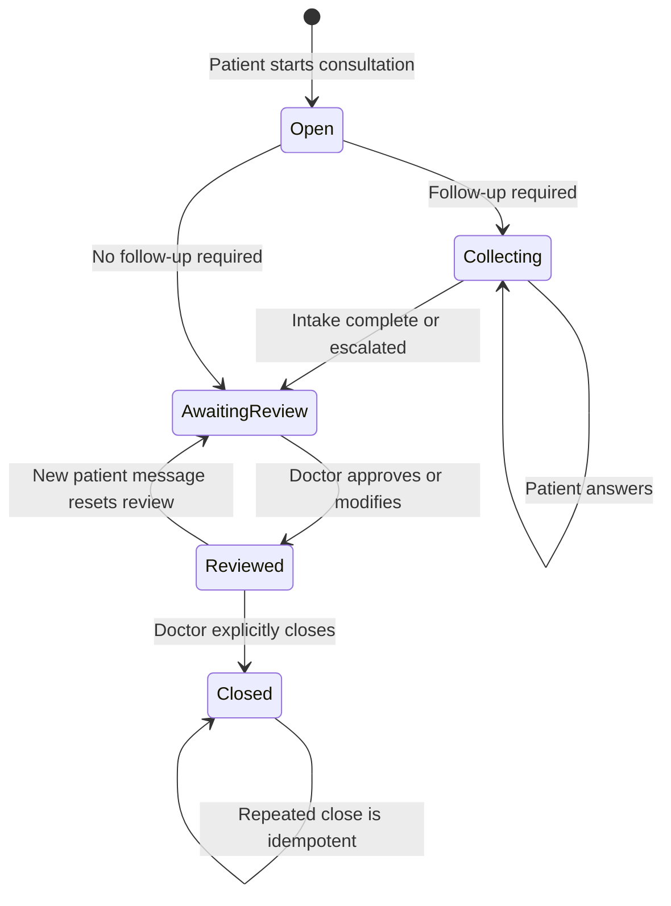

The doctor can approve the assessment as-is or modify risk, escalation fields, summary, recommended action, and selected tests. Review does not rerun automated safety because the doctor is the final human authority. A new patient message invalidates the earlier review. Closed encounters reject further messages and review changes.

Closure is permitted only after review. It persists `closed_at`, records closure events, and attempts memory extraction. Extraction failure does not roll back or block case closure.

---

## 11. Governed Memory Learning

Doctor memory and diagnostic-test learning are separate mechanisms. Memory captures durable preferences and patterns; test decisions capture structured evidence about catalog selections in comparable scenarios.

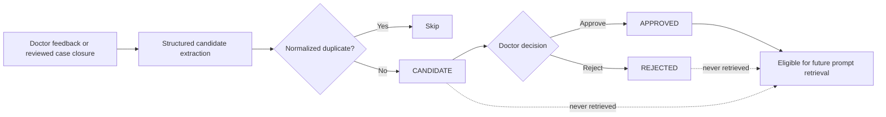

### Memory categories

- preference;
- escalation rule;
- communication style;
- clinical pattern;
- workflow preference.

Closure extraction may create at most one candidate per category. Exact normalized duplicates are skipped across all statuses. Only APPROVED memory is retrievable by the twin. Current retrieval ranks approved entries using naive keyword overlap and returns up to five; pgvector semantic retrieval is future work.

---

## 12. Diagnostic-Test Decision Learning

The hospital owns a catalog of test codes, names, categories, descriptions, activation state, and autonomous eligibility. Decisions reference catalog IDs, preserving consistent terminology and historical provenance.

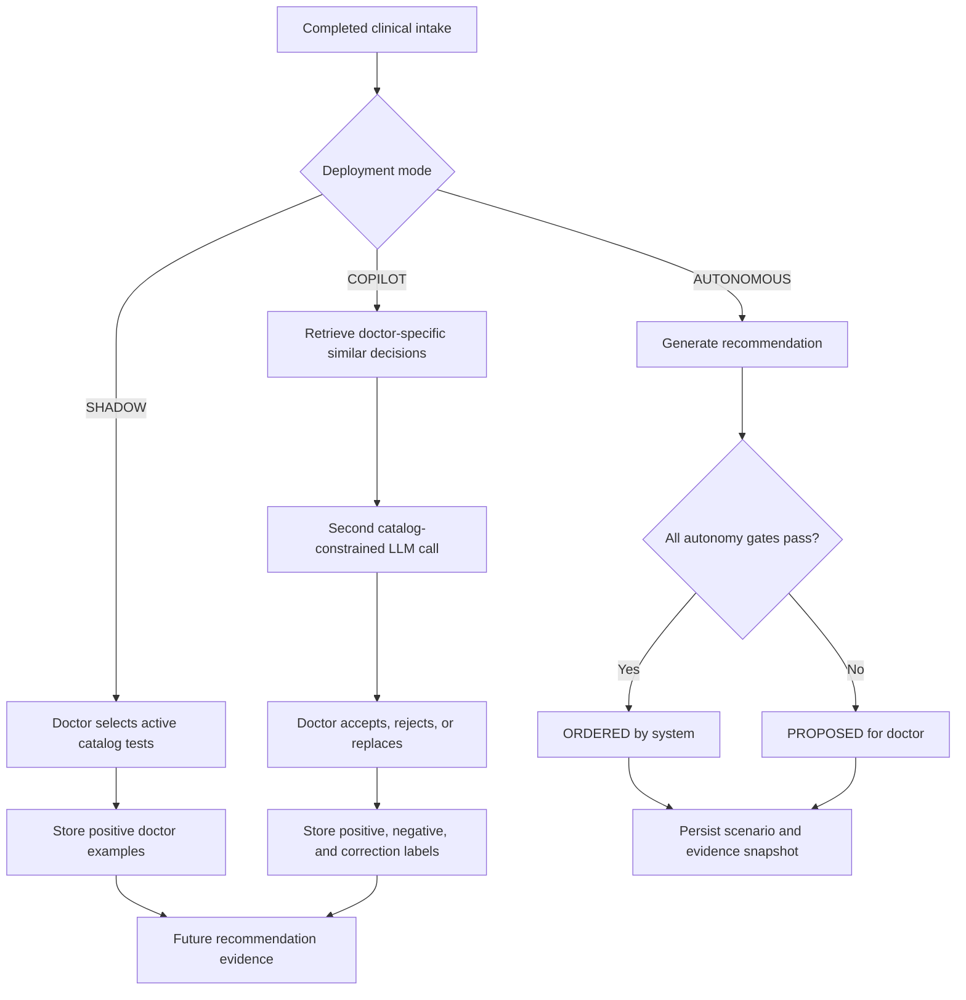

### Scenario matching

Evidence is isolated by doctor and derived from de-identified features: symptoms, risk, age band, sex, and relevant conditions. The similarity score is:

$$
S = 0.65J_{symptoms} + 0.15J_{conditions} + 0.10I_{risk} + 0.05I_{age} + 0.05I_{sex}
$$

where $J$ is token-set Jaccard similarity and $I$ is an exact-match indicator. Symptom overlap must be non-zero, and evidence is retained only when $S \ge 0.45$.

### Learning labels

| Source | Stored interpretation |
| --- | --- |
| SHADOW doctor-selected ORDERED test | Positive example |
| COPILOT recommended and accepted test | Positive example |
| COPILOT recommended and removed test | Negative example |
| COPILOT doctor-added replacement | Positive correction |
| AUTONOMOUS system decision | Never used to train itself |
| Open/unreviewed encounter | Excluded |

### Autonomous ordering gates

Every gate must pass:

1. Intake is complete, non-fallback, GREEN, and not escalated.
2. Catalog entry is active and `autonomous_eligible`.
3. Current recommendation confidence is at least `0.8` by default.
4. At least 2 matching SHADOW orders exist for that doctor.
5. At least 2 matching COPILOT decisions exist for that doctor.
6. Matching COPILOT acceptance rate is at least `0.75` by default.

Failed gates store the decision as PROPOSED with a `gate_reason`. Evidence snapshots are immutable so later history cannot change the explanation for an earlier decision. A doctor can finalize a proposal while retaining that evidence.

---

## 13. Data Model

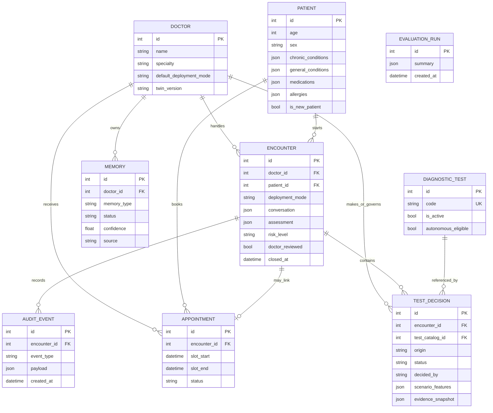

JSON columns are used for evolving structured content such as conversations, assessments, patient condition lists, audit payloads, and evidence snapshots. Enum values are stored as strings. Appointment times are intentionally naive datetimes because SQLite timezone round-tripping is inconsistent in this prototype.

---

## 14. API Reference

Interactive OpenAPI documentation is available at `http://127.0.0.1:8014/docs` while the backend is running.

### Health and profiles

| Method | Path | Purpose |
| --- | --- | --- |
| GET | `/health` | Service health check |
| GET | `/doctors` | List visible doctors |
| POST | `/doctors` | Onboard doctor in SHADOW mode |
| GET | `/doctors/{doctor_id}` | Get doctor profile |
| POST | `/doctors/{doctor_id}/mode` | Change default deployment mode |
| GET | `/patients` | List visible patients |
| POST | `/patients` | Register a new patient |
| GET | `/patients/{patient_id}` | Get patient profile |
| POST | `/patients/{patient_id}/conditions` | Append chronic/general condition |

### Consultations

| Method | Path | Purpose |
| --- | --- | --- |
| POST | `/consultations` | Start consultation and run twin/safety workflow |
| GET | `/consultations?doctor_id={id}` | List a doctor's cases |
| GET | `/consultations/patient/{patient_id}` | List patient's open, unreviewed cases |
| GET | `/consultations/{consultation_id}` | Get one case |
| POST | `/consultations/{id}/messages` | Add patient answer and re-evaluate |
| POST | `/consultations/{id}/review` | Approve/modify assessment and finalize tests |
| POST | `/consultations/{id}/close` | Close reviewed case and extract memory candidates |

### Memory, appointments, and evaluations

| Method | Path | Purpose |
| --- | --- | --- |
| GET | `/memories/{doctor_id}` | List all memory statuses for doctor |
| POST | `/memories` | Create candidate from doctor feedback |
| POST | `/memories/{memory_id}/approve` | Promote candidate to APPROVED |
| POST | `/memories/{memory_id}/reject` | Mark memory REJECTED |
| GET | `/appointments` | List appointments, optionally by doctor |
| GET | `/appointments/available-slots` | Get synthetic available slots |
| POST | `/appointments` | Book and optionally link appointment |
| POST | `/evaluations/run` | Execute and persist full evaluation suite |
| GET | `/evaluations/results` | Return latest persisted evaluation |

### Diagnostic-test catalog and administration

| Method | Path | Purpose |
| --- | --- | --- |
| GET | `/diagnostic-tests` | List active tests |
| GET | `/admin/diagnostic-tests` | List complete catalog |
| POST | `/admin/diagnostic-tests` | Create catalog entry |
| PATCH | `/admin/diagnostic-tests/{test_id}` | Edit or deactivate entry |
| GET | `/admin/data-summary` | Get resettable/protected row counts |
| POST | `/admin/reset-data` | Delete added data after typed confirmation |

### Representative request

```json
POST /consultations
{
  "doctor_id": 1,
  "patient_id": 1,
  "message": "I have had a persistent cough and fever for two days."
}
```

All frontend requests pass through the typed client in `frontend/lib/api.ts`; page components do not call `fetch` directly.

---

## 15. Clinic Tools and Mock MCP

The controlled clinic interface exposes:

- `get_patient`;
- `get_previous_visits`;
- `get_available_slots`;
- `create_appointment`;
- `create_clinical_note`.

The twin does not access the database directly. Clinic operations pass through tools and repositories. Available slots are synthetic hourly periods from 09:00 to 17:00, excluding existing bookings. Appointment creation can link the appointment to an encounter and emits an audit event. Clinical notes are represented as audit events rather than a dedicated table.

`mcp/clinic_server.py` mirrors this interface but delegates locally. It demonstrates the future integration boundary; it is not a protocol-compliant MCP server and does not connect to an EHR.

---

## 16. Evaluation Framework

The evaluation suite runs the same Doctor Twin and safety policy used by live consultations. It validates each synthetic case against the shared Pydantic schema and persists the complete result.

| Metric | Meaning |
| --- | --- |
| Red-flag recall | Fraction of expected RED cases classified RED |
| Escalation recall | Fraction of expected escalations actually escalated |
| Required-question coverage | Expected intake questions represented in model follow-ups |
| Structured-output validity | Responses satisfying the assessment schema |
| Doctor-preference alignment | Recommended action matching the expected action |

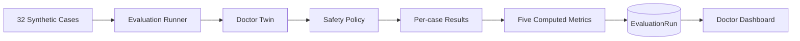

Metrics are computed from each actual run and are never hard-coded. Tests use scripted model doubles; a live CLI evaluation uses Gemini and therefore requires a configured API key.

---

## 17. Auditability and Governance

`AuditEvent` provides an append-only application-level record. Important event types include:

- `safety_override`;
- `escalation`;
- `doctor_approved_assessment`;
- `doctor_modified_assessment`;
- `doctor_finalized_test_decisions`;
- `autonomous_test_decisions_evaluated`;
- `appointment_created`;
- `clinical_note`;
- `case_closed`;
- `case_memory_extraction_failed`.

Assessment review events retain before/final assessment snapshots. Test decisions retain scenario and evidence snapshots. These records make automated and human decisions explainable within the limits of the prototype.

---

## 18. Configuration

Backend settings use the `TWIN_` prefix and are loaded through `pydantic-settings`.

| Variable | Default | Purpose |
| --- | --- | --- |
| `TWIN_APP_NAME` | `Doctor Digital Twin` | OpenAPI/application name |
| `TWIN_ENVIRONMENT` | `development` | Environment label |
| `TWIN_DATABASE_URL` | `sqlite:///./twin.db` | SQLAlchemy connection URL |
| `TWIN_GEMINI_API_KEY` | empty | Gemini credential; never commit it |
| `TWIN_GEMINI_MODEL` | `gemini-3.1-flash-lite` | Model identifier |
| `TWIN_EVAL_CASES_PATH` | unset | Optional evaluation-case override |
| `TWIN_CORS_ALLOW_ORIGINS` | `http://localhost:3000` | Comma-separated frontend origins |
| `TWIN_AUTONOMOUS_TEST_MIN_CONFIDENCE` | `0.8` | Test recommendation confidence gate |
| `TWIN_AUTONOMOUS_TEST_MIN_SHADOW_ORDERS` | `2` | Required matching SHADOW evidence |
| `TWIN_AUTONOMOUS_TEST_MIN_COPILOT_DECISIONS` | `2` | Required matching COPILOT evidence |
| `TWIN_AUTONOMOUS_TEST_MIN_COPILOT_ACCEPTANCE` | `0.75` | Minimum historical acceptance rate |
| `NEXT_PUBLIC_API_BASE_URL` | `http://127.0.0.1:8014` | Browser API base URL |

Secrets belong only in ignored local environment files or a deployment secret manager. A previously shared key should be treated as compromised and rotated; documentation must never contain it.

---

## 19. Local Setup and Operation

### Prerequisites

- Python 3.11 or newer;
- Node.js 22.12 or newer;
- npm;
- optional Gemini key for live model calls.

### Install

```powershell
cd C:\Users\ampathania\Desktop\Projects\Twin
.\.venv\Scripts\python.exe -m pip install -r backend\requirements.txt
cd frontend
npm install
cd ..
```

Create local environment files from the supplied examples and add secrets locally.

### Seed synthetic data

```powershell
npm run seed
```

The idempotent seed includes four doctors, eight patients, doctor-specific memory, and eight diagnostic tests.

### Start both applications

```powershell
npm run dev
```

- Frontend: `http://localhost:3000`
- Backend: `http://127.0.0.1:8014`
- OpenAPI: `http://127.0.0.1:8014/docs`

For a clean disposable database before startup:

```powershell
npm run dev:backend:fresh
```

This checks port 8014 before resetting. The reset is destructive and intended only for synthetic local development.

---

## 20. Testing and Quality Strategy

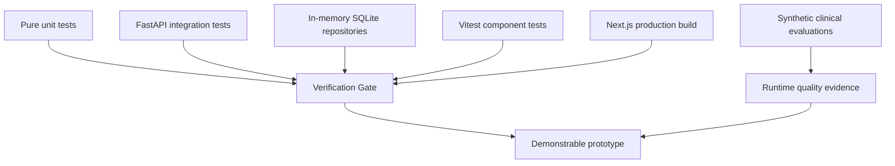

### Backend

```powershell
.\.venv\Scripts\python.exe -m pytest backend\tests -v
```

The suite uses a fresh in-memory SQLite database, `StaticPool`, and fake/scripted LLM clients. It performs no network calls and requires no real API key. Coverage includes repositories, structured output, fail-safe behavior, safety categories and negation, all deployment modes, consultation APIs, memory governance, closure extraction, appointments, admin reset, diagnostic-test learning/gates, and evaluations.

### Frontend

```powershell
cd frontend
npm test
npm run build
```

Current frontend tests cover optimistic intake/loading behavior and diagnostic-test recommendation/selection behavior.

### Latest verification

| Check | Result on 20 September 2026 |
| --- | --- |
| Backend pytest suite | 119 passed |
| Frontend Vitest suite | 3 passed across 2 files |
| Next.js production build | Successful; all routes generated |
| Noted warnings | Dependency/config deprecations only; no test or build failure |

---

## 21. Security, Privacy, and Clinical Risk

### Existing controls

- Synthetic-only data and explicit prototype positioning.
- Pydantic validation at API and model-output boundaries.
- Gemini JSON-mode structured responses.
- Deterministic safety override independent of the LLM.
- Conservative fallback when the provider or schema fails.
- Human review before closure and memory learning.
- Approved-only memory retrieval.
- Doctor-specific test evidence and strict autonomy gates.
- Catalog allowlisting and soft deactivation.
- Typed confirmation for destructive admin reset.
- CORS configured through environment settings.
- Audit records for material safety and workflow events.

### Production gaps

- No authentication, authorization, role enforcement, or patient identity verification.
- Patient consultation lookup trusts a caller-supplied patient ID.
- No encryption/key-management design beyond local environment variables.
- No rate limiting, abuse controls, session management, or CSRF strategy.
- No formal PHI handling, retention, consent, deletion, or residency policy.
- No validated clinical ruleset, formal hazard analysis, or regulatory approval.
- SQLite foreign-key enforcement and production concurrency guarantees are insufficient.
- Audit records are application append-only, not cryptographically tamper-evident.
- Raw provider SDK package is deprecated upstream and should be migrated before production.

The correct production posture is therefore **human-supervised research prototype**, not clinical deployment.

---

## 22. Known Limitations and Technical Debt

1. SQLite schema creation uses `create_all`; it creates tables but does not migrate existing columns. Local schema changes require reset/reseed unless manually migrated.
2. The read side tolerates incomplete stored assessments, but the write path can still leave an initially created encounter if a failure occurs between commits.
3. Memory retrieval uses lexical overlap rather than embeddings.
4. Test-scenario similarity is deterministic and explainable but clinically unvalidated.
5. Evaluation required-question matching is substring-based; one-question-per-turn behavior can lower coverage for cases listing multiple simultaneous required questions.
6. The MCP layer is an adapter demonstration, not a transport implementation.
7. Appointment inventory is synthetic and has no timezone, clinician schedule, cancellation, or external synchronization model.
8. Frontend automated coverage is small relative to the number of user workflows.
9. No background job queue exists; live evaluation and LLM operations run within request workflows.
10. No deployment manifests, containers, CI pipeline, telemetry, or production database configuration are included.

---

## 23. Recommended Production Roadmap

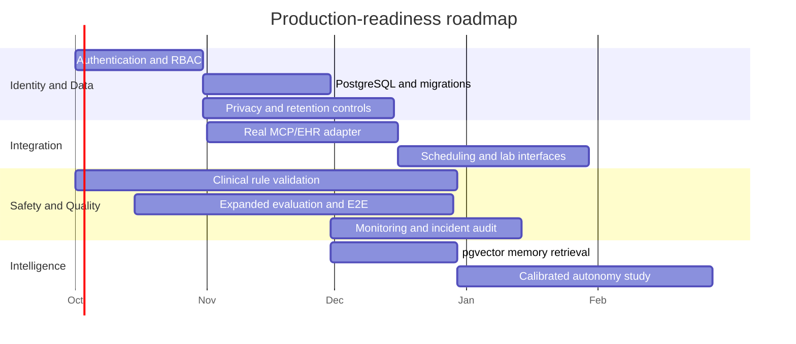

Priority should be authentication/RBAC, database migrations, privacy controls, and clinical safety validation before expanding autonomous behavior. Autonomous thresholds should ultimately be calibrated from reviewed evidence rather than treated as universal constants.

---

## 24. Project Evolution and Design Decisions

The implementation history shows an incremental, test-driven progression:

1. A minimal FastAPI scaffold was replaced with the domain-oriented `backend/app` structure.
2. Core doctor, patient, repository, Twin, safety, and deployment-mode phases were implemented.
3. Clinic tools, mock MCP, governed memory, and synthetic evaluations were added.
4. Next.js patient, doctor, and admin experiences were connected through additive APIs.
5. Doctor review/modify behavior and per-doctor deployment modes were introduced.
6. SHADOW mode was tightened to factual collection only, with the doctor authoring the response.
7. Patient profile handling was separated into chronic and general conditions.
8. Emergency intake disabled further chat and routed the case to the dashboard.
9. Explicit closure and best-effort candidate-memory extraction completed the learning loop.
10. Diagnostic-test catalog, labels, evidence retrieval, and autonomous gates added a separate decision-learning loop.
11. Structured-output enforcement, repeated-question limits, provider fail-safe behavior, and defensive stored-assessment parsing hardened reliability.

The key design decision remained stable throughout: use one reusable Doctor Twin implementation and personalize it with doctor profile, approved memory, and doctor-scoped evidence. Maintaining a separate agent implementation per doctor would duplicate code, fragment safety controls, and make governance harder.

---

## 25. Repository Map

```text
Twin/
|-- backend/
|   |-- app/
|   |   |-- agents/          # Doctor Twin, prompts, Gemini client, mode policy
|   |   |-- api/             # FastAPI routers
|   |   |-- memory/          # Retrieval, candidate lifecycle, extraction
|   |   |-- models/          # Pydantic and SQLAlchemy models
|   |   |-- repositories/    # Persistence abstraction
|   |   |-- safety/          # Red flags and deterministic override
|   |   |-- services/        # Workflow orchestration
|   |   `-- tools/           # Controlled clinic operations
|   `-- tests/               # Hermetic backend test suite
|-- evals/                   # Synthetic cases and CLI wrappers
|-- frontend/
|   |-- app/                 # /intake, /dashboard, /admin
|   |-- components/          # Shared clinical UI components
|   |-- lib/api.ts           # Typed backend client
|   `-- test/                # Vitest setup
|-- mcp/                     # Mock clinic MCP adapter
|-- README.md                # Quickstart and project overview
`-- TECHNICAL_DOCUMENTATION.md
```

---

## 26. Conclusion

Doctor Digital Twin demonstrates a practical architecture for incrementally deploying doctor-personalized AI while preserving deterministic safety controls and explicit human governance. Its strongest engineering properties are separation of concerns, schema-constrained model output, fail-safe escalation, immutable decision evidence, approved-only learning, and broad hermetic backend testing.

The prototype is complete enough to demonstrate patient intake, doctor oversight, governed learning, evidence-gated test decisions, and system evaluation end to end. Its limitations are also explicit: it remains synthetic, unauthenticated, locally persisted, and clinically unvalidated. Those boundaries are essential to interpreting the project responsibly.

---

## Appendix A: Key Source Files

- `backend/app/main.py` - application composition and CORS.
- `backend/app/config.py` - environment configuration.
- `backend/app/agents/doctor_twin.py` - personalized Twin orchestration and fail-safe parsing.
- `backend/app/agents/prompts.py` - assessment and extraction prompts.
- `backend/app/agents/deployment_policy.py` - mode permissions.
- `backend/app/safety/red_flags.py` - deterministic detection.
- `backend/app/safety/policy.py` - risk override.
- `backend/app/services/consultation_service.py` - consultation lifecycle.
- `backend/app/services/diagnostic_test_service.py` - decision labeling and autonomous gates.
- `backend/app/services/test_learning_service.py` - scenario matching and evidence.
- `backend/app/services/evaluation_service.py` - evaluation source of truth.
- `backend/app/memory/extraction.py` - case-closure extraction.
- `backend/app/memory/retrieval.py` - approved-only retrieval.
- `backend/app/tools/clinic_tools.py` - clinic operations.
- `backend/app/models/domain.py` - persistence model.
- `backend/app/models/schemas.py` - API and structured-output contracts.
- `frontend/app/intake/page.tsx` - patient workflow.
- `frontend/app/dashboard/page.tsx` - doctor workflow, memory, and evaluations.
- `frontend/app/admin/page.tsx` - administration.
- `frontend/lib/api.ts` - frontend/backend contract.
- `evals/cases.json` - synthetic evaluation corpus.
- `mcp/clinic_server.py` - mock integration boundary.

## Appendix B: Glossary

| Term | Definition |
| --- | --- |
| Doctor Twin | Runtime-personalized agent using doctor profile, approved memory, and governed evidence |
| ClinicalAssessment | Validated structured output produced by the model or fail-safe |
| Red flag | Deterministically detected emergency indicator that forces RED escalation |
| Candidate memory | Proposed learning item that cannot influence the twin until approved |
| Evidence snapshot | Immutable record of supporting historical decisions at decision time |
| Deployment mode | Policy controlling which actions the same Twin may take |
| MCP | Model Context Protocol; represented here only by a mock adapter boundary |